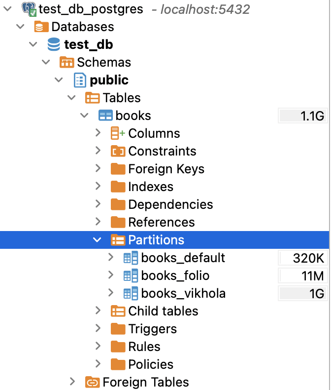
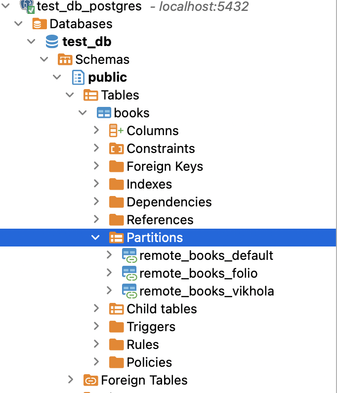
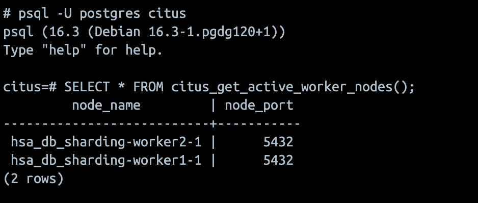
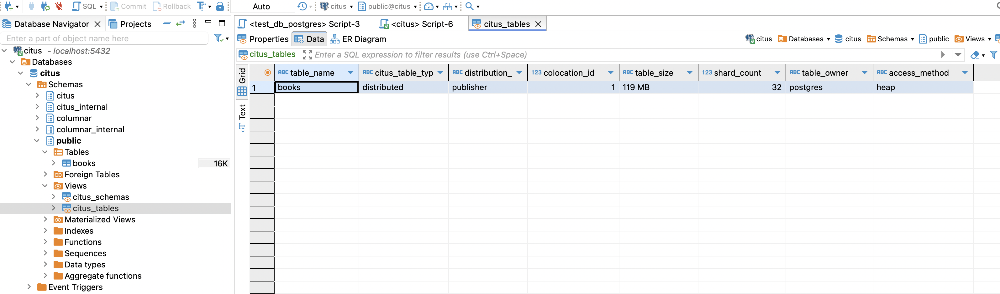

# HSA database sharding

<h3>Single vs Partitioned table</h3>

Prerequisites:
- Table with/without partitions are created
- PostgreSQL native partitioning is configured
- 10M records data is populated on database startup

Select query:
```
select count(*) from books where publisher = 'Komora';
```

Insert query (1M records):
```
do $$
begin
for i in 1..1000000 loop
INSERT INTO books (author, name, publisher, year)
VALUES
	('Viktor Domontovych', 'Дівчина з ведемедиком', 'Komora', 2019);
end loop;
end;
$$;
```

| Query     | No partitions (ms) | With partitions (ms) | No partitions + index (ms) | With partitions + index (ms) |
|-----------|--------------------|----------------------|----------------------------|------------------------------|
| Select    | 700                | 0.25                 | 0.04                       | 0.04                         |
| Insert 1M | 5000               | 10000                | 8000                       | 12000                        |

Conclusions:

1. Table partitioning dramatically improved select time
2. Introducing indexes made select query results similar for both cases 
3. Insertion time without partitions looks better (think more data is needed to reveal 'partitioning' effect on data insert)

Partitioned ``books`` table:




<h3>FDW sharded table</h3>

Prerequisites:
- Table with remote shards are created
- 1M records data is populated on edge database startup

Select query on edge:
```
select count(*) from books where publisher = 'Komora';
```

Insert query (3M records) on edge: 
```
do $$
begin
for i in 1..1000000 loop
INSERT INTO books (author, name, publisher, year)
VALUES
    ('Valerian Pidmohylyny', 'Місто', 'Vikhola', 2022),
    ('Mykola Khvylovy', 'Я (Романтика)', 'Folio', 2021),
	('Viktor Domontovych', 'Дівчина з ведемедиком', 'Komora', 2019);
end loop;
end;
$$;
```

| Query (edge server) | No shards (ms) | With shards (ms) |
|---------------------|----------------|------------------|
| Select              | 100            | 1.2              |
| Insert 3M           | 12500          | 600000           |

Conclusions:

1. Sharded table shows much better select time results
2. Inserting data into shards is predictably slower due to data transfer over the network

Sharded ``books`` table:




<h3>Citus sharded table</h3>

Verify cluster setup by running query on master mode:
```
psql -U postgres citus

SELECT * FROM citus_get_active_worker_nodes();
```


Create distributed (sharded) table:
```
SELECT create_distributed_table('books', 'publisher');
```

| Query (master node) | With shards (ms) |
|---------------------|------------------|
| Select              | 10               |
| Insert 3M           | 360000           |

Conclusions:

1. Select query result is worse comparing to FDW sharded table
2. Inserting data is better comparing to FDW sharded table

Citus master node configuration:

